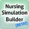
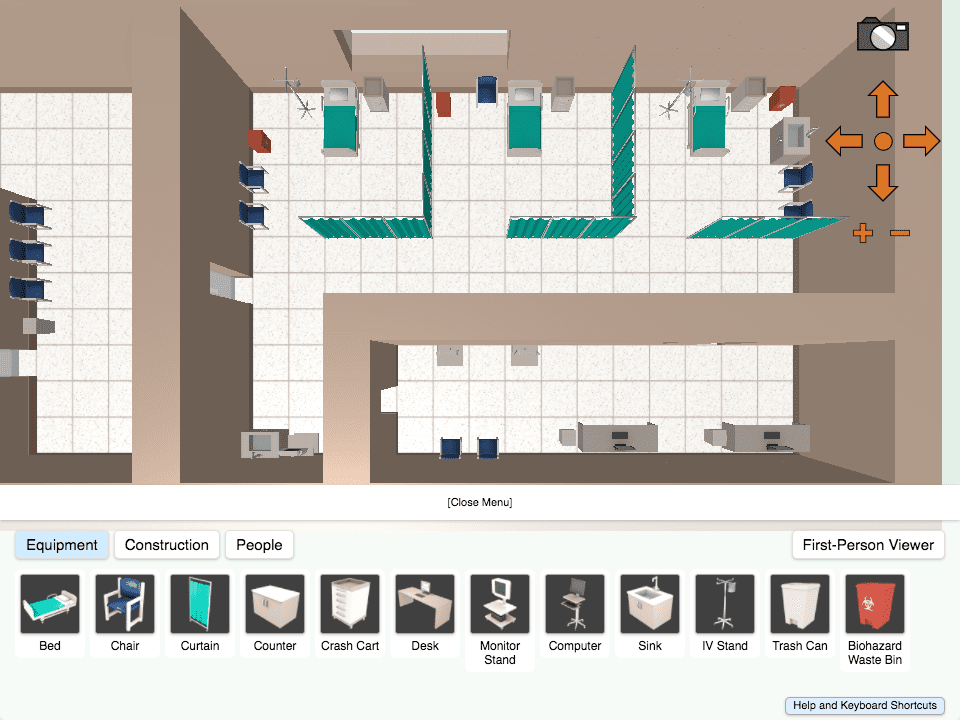

<h1>
    
    Nursing Simulation Builder: A Materia Widget
</h1>

Design a 3D nursing simulation space by filling rooms with an inventory of items such as beds, IVs, Crash Carts, and seating. Use the first-person viewer to experience your simulation space from the eyes of an occupant. Nursing Simulation Builder is designed for use with [Materia](https://github.com/ucfopen/Materia), an open-source platform for interactive course content developed by the University of Central Florida.

Note: While stable builds are pushed every semester or two, this product is still in development.

### Basic Use

In a production evironment, Nursing Simulation Builder is installed to your Materia instance and is accessed via the Widget Catalog. For development, Nursing Simulation Builder is bundled with the [Materia Widget Development Kit](https://github.com/ucfopen/Materia-Widget-Dev-Kit), which allows for rapid development in a local context using express.js.

### Local Development

Nursing Simulation Builder uses the Materia Widget Development Kit for local development. Check out [the docs for the MDK](https://ucfopen.github.io/Materia-Docs/develop/materia-widget-development-kit.html) to learn more about starting up the local express environment.

### Installation to Materia

Widget installation options are covered in the [Installing Widgets](https://ucfopen.github.io/Materia-Docs/admin/installing-widgets.html) section of the Materia Docs.

For more information about the widget development process, be sure to visit the [widget developer guide](https://ucfopen.github.io/Materia-Docs/develop/widget-developer-guide.html) for Materia.